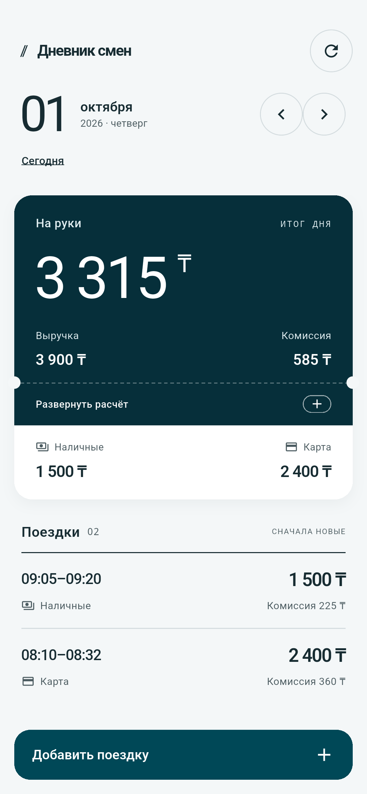
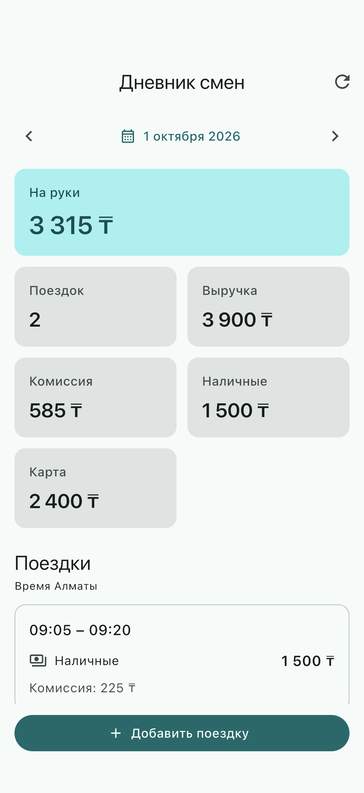
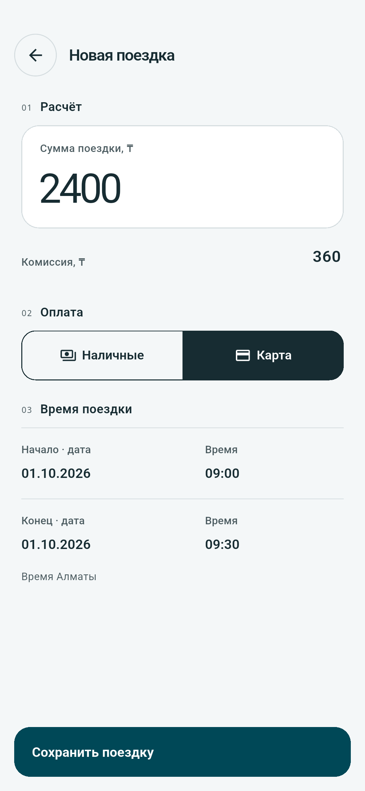
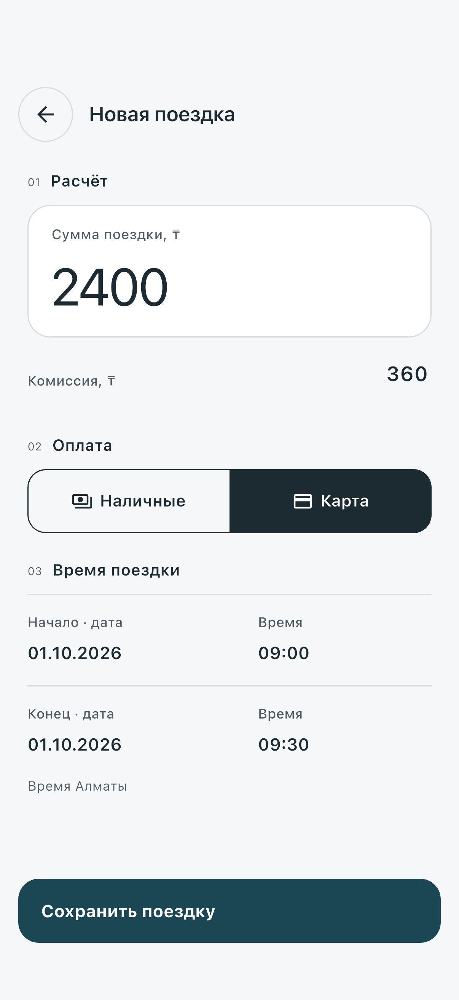

# Дневник смен водителя

Тестовое задание arqa: Flutter-приложение для просмотра поездок и финансовой
сводки за день, с Python API и SQLite. Клиент работает на Android и iOS;
интерфейс на русском языке, суммы в тенге.

## Скриншоты

Снимки сделаны на Android Emulator и iOS Simulator с настоящим API и
демонстрационными данными за 1 октября. Форма заполнена перед сохранением.

| Экран | Android Emulator | iOS Simulator |
|---|---|---|
| День со сводкой |  |  |
| Форма добавления |  |  |

Быстрый переход: [запуск сервера](#сервер-зависимости-миграция-и-импорт) ·
[запуск приложения](#запуск-мобильного-приложения).

Требования, согласованные решения, история проверок и журнал использования ИИ
находятся в [ROADMAP.md](ROADMAP.md). Правила работы над проектом — в
[AGENTS.md](AGENTS.md).

## Что реализовано

- Выбор дня в календаре, переходы назад/вперёд и возврат к сегодняшней дате.
- Сводка: число поездок, выручка, комиссия, «на руки», наличные и карта.
- Список поездок: новые сверху, время начала/окончания, сумма, комиссия и оплата.
- Загрузка, пустой день, ошибка с повтором, кнопка обновления и pull-to-refresh.
- Форма добавления с отдельными датами и временем начала/окончания, проверкой
  денежных полей и выбором наличных или карты.
- Защита от двойного нажатия. При неизвестном результате отправки сохраняются
  ID и данные для точного повтора; форму можно закрыть и открыть снова.
- После сохранения обновляется день начала поездки. Запоздалый ответ другого
  дня не заменяет данные выбранной даты.
- Валидация API, защита от последовательных и конкурентных дублей, миграция БД
  и атомарный повторяемый импорт демонстрационных данных.

## Стек и структура

| Часть | Технологии |
|---|---|
| Клиент | Flutter, Material 3, Riverpod без кодогенерации, Dio |
| Деньги и часовой пояс клиента | `BigInt`, `json_bigint`, `timezone` |
| Сервер | Python 3.12, FastAPI, Pydantic 2, Uvicorn |
| Хранение | SQLite, SQLAlchemy 2, Alembic |
| Зависимости | `uv` и `backend/uv.lock`; `mobile/pubspec.lock` |
| Проверки | Ruff, pytest; Dart formatter, Flutter analyzer, unit/widget-тесты |
| CI | GitHub Actions |

```text
backend/
  app/api/          HTTP-маршруты и схемы
  app/domain/       правила данных и границы дня
  app/services/     добавление поездок и расчёт сводки
  app/db/           модели и запросы SQLite
  app/import_trips.py
  alembic/          миграции
  data/trips.json   две демонстрационные поездки
  tests/
mobile/
  lib/api/          HTTP-клиент
  lib/models/       модели дня и поездки
  lib/state/        Riverpod-состояние
  lib/widgets/      экран дня и форма
  test/             unit/widget-тесты
  integration_test/ сценарии с настоящим API
docs/screenshots/
```

Сводку рассчитывает сервер. Flutter отображает полученные значения и сохраняет
точность JSON-чисел, в том числе больших целых сумм.

## Окружение

Для сервера нужны Python **3.12** и uv. Для клиента — Flutter **3.44.4** с Dart
**3.12.2** и доступом к сети при первой установке зависимостей. Версия Dart
ограничена в `mobile/pubspec.yaml`; зависимости закреплены lock-файлами.

Для Android нужны Android SDK и JDK 17, эмулятор или устройство. Для iOS нужны
macOS, Xcode с установленной платформой iOS Simulator и CocoaPods. Локальный
демонстрационный сценарий ниже использует Android Emulator и iOS Simulator.

Проверенное окружение: Android SDK/build-tools **36.0.0**,
Android Emulator **36.1.9**, JDK **17.0.7**, Xcode **26.6**, CocoaPods **1.17.0**,
Python **3.12.4** на этапе 1 и **3.12.15** при чистой установке на этапе 6,
uv **0.12.23**. Это сведения о проведённых проверках, а не
перечень всех совместимых версий. Их результаты описаны в roadmap.

Установку Flutter и платформенных инструментов описывает
[официальная документация Flutter](https://docs.flutter.dev/install).
Перед запуском проверьте окружение:

```sh
flutter --version
flutter doctor -v
flutter devices
```

Установка проверенной версии uv на macOS/Linux по
[инструкции Astral](https://docs.astral.sh/uv/getting-started/installation/),
с [явным каталогом установки](https://docs.astral.sh/uv/reference/installer/):

```sh
curl -LsSf https://astral.sh/uv/0.12.23/install.sh | env UV_INSTALL_DIR="$HOME/.local/bin" UV_NO_MODIFY_PATH=1 sh
export PATH="$HOME/.local/bin:$PATH"
```

Затем:

```sh
uv --version
uv python install 3.12
```

Установщик в этой команде не изменяет настройки shell. Добавляйте
`export PATH="$HOME/.local/bin:$PATH"` в каждом новом терминале или сохраните
эту строку в конфигурации своего shell, если каталог ещё не входит в `PATH`.

Если Python 3.12 и uv уже доступны, повторная установка не нужна. Все следующие
команды выполняются в shell macOS/Linux. Получите файлы репозитория и откройте
терминал в его корне; URL публичного репозитория ещё не назначен.

## Сервер: зависимости, миграция и импорт

Из корня проекта:

```sh
cd backend
uv sync --locked --python 3.12
uv run --locked alembic upgrade head
uv run --locked python -m app.import_trips data/trips.json
```

`uv sync` создаёт `backend/.venv`, включая зависимости проверок. `--locked`
проверяет согласованность lock-файла и не обновляет его автоматически.
Миграцию нужно выполнить до работы с поездками: запуск API не создаёт таблицы.

По умолчанию БД — `backend/driver_diary.db`; её путь определяется относительно
кода сервера, независимо от текущего каталога процесса. Файлы БД и их журналы
исключены из Git. Для своей БД задайте один и тот же `DATABASE_URL` для миграции,
импорта и сервера, например, перед этими командами из `backend/`:

```sh
export DATABASE_URL="sqlite:///$PWD/local-demo.db"
```

При абсолютном Unix-пути SQLite URL содержит четыре `/` перед первым каталогом.
Родительский каталог БД должен существовать. Без `DATABASE_URL` используется
путь по умолчанию; `.env` автоматически не загружается.

В новом хранилище импорт выведет `создано 2, повторов 0`. Повторите команду:

```sh
uv run --locked python -m app.import_trips data/trips.json
```

Результат — `создано 0, повторов 2`; поездки и сводка не изменятся. Импорт
сначала проверяет весь UTF-8 JSON-массив, затем сохраняет его в одной транзакции.
Неверные данные, конфликт ID или ошибка записи отменяют весь импорт; CLI
завершается с ненулевым кодом. Миграции не импортируют данные автоматически.

Запустите сервер и оставьте терминал открытым:

```sh
uv run --locked uvicorn app.main:app --host 127.0.0.1 --port 8000
```

В другом терминале:

```sh
curl --fail http://127.0.0.1:8000/health
curl --fail http://127.0.0.1:8000/api/v1/days/2026-10-01
```

`/health` возвращает `{"status":"ok"}` и проверяет доступность процесса;
чтение дня дополнительно проверяет работу с мигрированной БД. Документация API —
[Swagger UI](http://127.0.0.1:8000/docs), схема —
[OpenAPI](http://127.0.0.1:8000/openapi.json).

## Запуск мобильного приложения

В новом терминале из корня проекта:

```sh
cd mobile
flutter pub get --enforce-lockfile
flutter emulators
flutter devices
```

Запустите Android Emulator из Android Studio или командой
`flutter emulators --launch EMULATOR_ID`; для iOS откройте Simulator на macOS.
Заменяйте `EMULATOR_ID` и `DEVICE_ID` реальными значениями вывода Flutter.

Адрес API задаётся при запуске/сборке через `--dart-define=API_BASE_URL=...`:

| Клиент | Адрес локального сервера |
|---|---|
| Android Emulator | `http://10.0.2.2:8000` |
| iOS Simulator | `http://127.0.0.1:8000` |

Android Emulator использует `10.0.2.2` для доступа к компьютеру с сервером.
Значение приложения по умолчанию — `http://127.0.0.1:8000`, поэтому Android
адрес нужно передать явно. Сервер должен быть запущен.

Android, из `mobile/`:

```sh
flutter run --debug -d DEVICE_ID --dart-define=API_BASE_URL=http://10.0.2.2:8000
```

iOS, из `mobile/` на macOS:

```sh
flutter run --debug -d DEVICE_ID --dart-define=API_BASE_URL=http://127.0.0.1:8000
```

Приложение открывает сегодняшний день по Алматы. Для демонстрационного примера
выберите **1 октября 2026** в календаре. Ожидается:

| Показатель | Значение |
|---|---|
| Поездки | 2 |
| Выручка | 3900 ₸ |
| Комиссия | 585 ₸ |
| На руки | 3315 ₸ |
| Карта | 2400 ₸ |
| Наличные | 1500 ₸ |

На чистой демонстрационной БД 2 октября — пустой день. Для добавления нажмите
«Добавить поездку», введите целую сумму и комиссию, выберите даты/время и оплату,
затем сохраните. Поездка через полночь появится в дне её начала.

## API и бизнес-правила

`GET /api/v1/days/YYYY-MM-DD` возвращает `date`, `trips` и `summary` с полями
`trip_count`, `revenue`, `commission`, `net_income`, `cash`, `card`. Времена в
ответе нормализованы в UTC; поездки отсортированы по началу, новые сверху.
Пустой день возвращает `[]` и нули, неверная дата — `422`.

`POST /api/v1/trips` принимает JSON:

```json
{
  "id": "t1",
  "start": "2026-10-01T08:10:00+05:00",
  "end": "2026-10-01T08:32:00+05:00",
  "amount": 2400,
  "payment": "card",
  "commission": 360
}
```

Для проверки повторной отправки после импорта:

```sh
curl -i http://127.0.0.1:8000/api/v1/trips \
  -H 'Content-Type: application/json' \
  --data '{"id":"t1","start":"2026-10-01T08:10:00+05:00","end":"2026-10-01T08:32:00+05:00","amount":2400,"payment":"card","commission":360}'
```

| Сценарий POST | Статус |
|---|---|
| Новый ID, корректные данные | `201` |
| Тот же ID и нормализованные данные | `200`, существующая поездка |
| Тот же ID, отличающиеся данные | `409` |
| Неверные данные | `422` |

ID — непустая строка. Окончание строго позже начала; ISO 8601 должен содержать
часовое смещение. Сумма — положительное целое число, комиссия — неотрицательное
целое число, оплата — `cash` или `card`. Строки, дробные числа и булевы значения
в денежных полях отклоняются. Максимум для одного денежного поля —
**9223372036854775807** тенге, предел SQLite INTEGER.

Идентичность определяется ID и всеми данными после нормализации времени в UTC.
Одинаковые моменты с разными часовыми смещениями считаются равными; разные ID
обозначают разные поездки даже при равных остальных полях. Уникальность ID
обеспечивается первичным ключом SQLite и атомарной вставкой с обработкой
конфликта. Импорт использует те же правила, что и API.

День — полуоткрытый интервал `[полночь, следующая полночь)` в `Asia/Almaty`,
определённый по началу поездки. Системный часовой пояс сервера/телефона на него
не влияет. Выручка — сумма `amount`, комиссия — сумма `commission`, «на руки» —
их разность. Карта и наличные разбивают выручку; их сумма равна общей выручке.
Комиссия является суммой, а не процентом; она может превышать выручку, тогда
«на руки» отрицательно. Денежные расчёты целочисленные на сервере и клиенте.

## Проверки и сборки

Из `backend/`, после `uv sync --locked --python 3.12`:

```sh
uv lock --check
uv run --locked ruff check .
uv run --locked ruff format --check .
uv run --locked pytest
```

Из `mobile/`, после `flutter pub get --enforce-lockfile`:

```sh
dart format --output=none --set-exit-if-changed .
flutter analyze
flutter test
flutter build apk --debug --dart-define=API_BASE_URL=http://10.0.2.2:8000
flutter build ios --simulator --dart-define=API_BASE_URL=http://127.0.0.1:8000
```

Последняя команда требует macOS и Xcode. Артефакты:
`mobile/build/app/outputs/flutter-apk/app-debug.apk` и
`mobile/build/ios/iphonesimulator/Runner.app`. Сборки сами по себе не проверяют
сценарии работы с API.

Серверные тесты покрывают суммы и границы дня, строгую валидацию, повторы,
конфликты, атомарность импорта и сохранность данных при повторном запуске API.
Конкурентные запросы проверяются отдельными сессиями/соединениями на временной
файловой SQLite. Клиентские тесты покрывают модели, состояние, календарь,
запоздалые ответы, загрузку/ошибки, форму, точный повтор и обновление сводки.

### Интеграционные сценарии с настоящим API

Тест чтения ожидает две исходные поездки 1 октября и пустой день 2 октября.
Тест добавления изменяет БД и требует пустых `TEST_DAY` и следующего дня.
Используйте отдельное новое хранилище, чтобы не затронуть свои данные.
Из `backend/`, при остановленном другом сервере на порту 8000:

```sh
arqa_test_dir=$(mktemp -d)
export DATABASE_URL="sqlite:///$arqa_test_dir/trips.db"
uv run --locked alembic upgrade head
uv run --locked python -m app.import_trips data/trips.json
uv run --locked uvicorn app.main:app --host 127.0.0.1 --port 8000
```

В другом терминале из `mobile/`, подставив ID Android Emulator:

```sh
flutter test integration_test/live_day_test.dart -d DEVICE_ID --dart-define=API_BASE_URL=http://10.0.2.2:8000
flutter test integration_test/live_trip_test.dart -d DEVICE_ID --dart-define=API_BASE_URL=http://10.0.2.2:8000 --dart-define=TEST_DAY=2026-10-03
```

На той же новой БД можно проверить iOS Simulator, подставив его ID и другую
пустую дату:

```sh
flutter test integration_test/live_day_test.dart -d DEVICE_ID --dart-define=API_BASE_URL=http://127.0.0.1:8000
flutter test integration_test/live_trip_test.dart -d DEVICE_ID --dart-define=API_BASE_URL=http://127.0.0.1:8000 --dart-define=TEST_DAY=2026-10-05
```

Перед повтором теста добавления создайте новую тестовую БД или выберите другой
пустой день вместе с пустым следующим днём. Сценарий добавления намеренно
отбрасывает успешный ответ настоящего сервера после commit, закрывает/открывает
форму и повторяет тот же запрос: ожидает `200`, две поездки и сводку 3900/585/3315.
Он также проверяет поездку через полночь и сохранение выбранной даты.

CI запускает проверки Python и Flutter, Android debug-сборку и iOS Simulator
сборку на macOS. Сценарии с запущенными устройствами выполняются отдельно.
Фактически выполненные локальные проверки и ограничения этапа 6 перечислены в
[roadmap](ROADMAP.md#этап-6-проверка-и-сдача). Успешный удалённый запуск GitHub
Actions можно подтвердить после публикации репозитория.

## Ограничения первой версии

- Один водитель; авторизации, нескольких пользователей и публичного деплоя нет.
- Нет редактирования/удаления поездок, офлайн-синхронизации и постоянной очереди
  отправки на диске. Неподтверждённые ID и данные сохраняются только до завершения
  текущего процесса приложения; после его перезапуска этот повтор не восстановится.
- Локальный HTTP разрешён только для адресов разработки в debug-конфигурациях.
  Для иного сервера и производственной сборки нужен HTTPS и отдельная настройка.
- Физические устройства и магазинные release-сборки не входят в проверенный
  демонстрационный сценарий. iOS Simulator-сборка не требует подписи для устройства.
- Публикация репозитория, деплой, подпись для магазинов и отправка анкеты — отдельные
  действия; подготовка проекта их не выполняет.

## Использование ИИ

Codex и субагенты участвовали в разработке по этапам: анализе требований,
подготовке roadmap, каркасах, серверных моделях/импорте/API, клиентских моделях,
состоянии/виджетах, тестах и независимом ревью. Пользователь согласовал стек,
платформы и бизнес-правила. Результаты проверялись форматтерами, анализаторами,
автоматическими тестами, запросами к настоящему Uvicorn и запуском приложения
на Android Emulator/iOS Simulator.

На этапе 6 субагенты подготовили этот README, GitHub Actions и временный
инструмент снимков. Основной агент проверил чистую установку зависимостей,
миграцию и повторный импорт, 182 серверных и 170 клиентских тестов, обе сборки,
четыре интеграционных сценария с настоящим API и обычный запуск клиентов.
Скриншоты просмотрены визуально; CI/README прошли независимое ревью, workflow —
actionlint. Удалённый запуск GitHub Actions работает.

Примеры фактических ошибок и исправлений из журнала:

- Большая целая сумма при импорте вызывала необработанный `OverflowError` SQLite:
  добавлены понятная ошибка CLI и тесты полного отката.
- Ревью API выявило округление денежного предела в OpenAPI: точный максимум
  добавлен в описание полей; валидация осталась целочисленной.
- Ревью клиента выявило устаревшее «Сегодня» после полуночи: добавлены таймер и
  обновление при возврате в приложение, затем повторены тесты и ревью.
- В интеграционном тесте формы `TestTextInput.hide` не работал с клавиатурой
  устройства, а `pageBack` не находил собственную кнопку: использованы снятие
  фокуса и ключ `close-trip`, сценарий повторён на обеих платформах.

Полный журнал с вкладом ИИ, результатами проверок и исправлениями — в
[ROADMAP.md](ROADMAP.md#журнал-использования-ии). Ошибки и действия пользователя
не выдумывались для отчёта.
